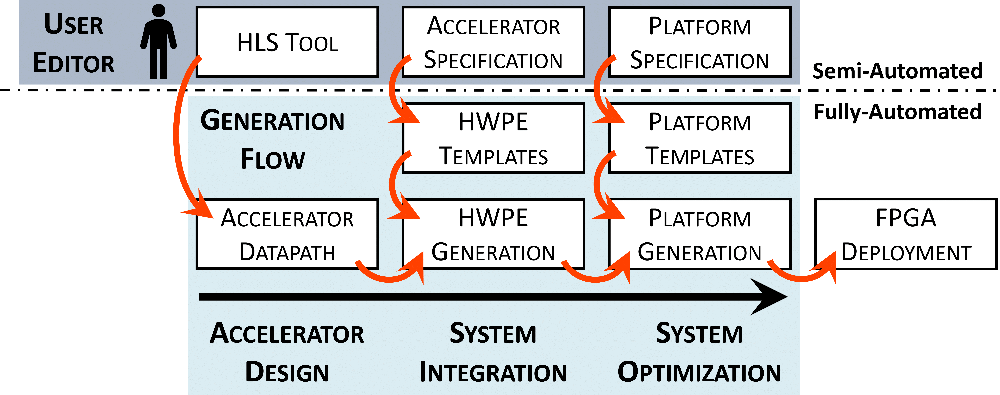

# The Richie Toolchain
The *Richie Toolchain* is a System-Level Design (SLD) Toolchain that automates and simplifies the HW/SW assembling and specialization of *Accelerator-Rich Heterogeneous Systems-on-Chip (HeSoCs)*.
The Toolchain comprises a set of Python-based tools, which enables the seamless and rapid composition of accelerators into full-fledged Accelerator-Rich HeSoCs, from a *high-level description*. Indeed, the Toolchain supports various *accelerator design flows*, e.g., leveraging High-Level Synthesis (HLS).
Generated HeSoCs are based on the [Parallel Ultra Low Power (PULP) Platform](https://pulp-platform.org/index.html), an open-source research and development platform targeting highly parallel architectures for ultra-low-power processing based on the RISC-V Instruction Set Architecture (ISA). The *Richie Toolchain* was formerly named *GenOv*.

## Getting Started

### Clone the Repository
To clone the repository, use the following command:
```
git clone https://github.com/gbellocchi/richie-toolchain.git
```

### The Richie Environment
Be sure that `RICHIE_HW` is set to the root of the Richie hardware subsystem (e.g. `/home/user-name/workspace_user/richie/hardware`).

### Python Virtual Environment
The toolchain leverages a Python virtual environment in order to manage the tool dependencies.  The toolchain has been tested with `Python 3.8.10`, so we recommend to stick with this version.
To create the environment and install the required packages (listed inside `requirements.txt`), simply run:

```
make py_env_init
```
Then, the environment can be activated by `source richie-py-env/bin/activate`.
If new packages are added, the environment can be updated with the following command:

```
make py_env_update_reqs
```
Note that the `py_env_init` command should be run again to install newly added packages and/or update old ones.

### External Sources
External Git submodules can be pulled with the following command:

```
make richie_gen_init
```

## System-Level Design
The *Richie Toolchain* facilitates three SLD phases concerning the assembling of Accelerator-Rich HeSoCs: (i) **accelerator design**; (ii) **system integration**; (iii) **system optimization**.

<div  align="center">


*The Richie Toolchain Architecture*
</div>

### Accelerator Design
This phase produces the accelerator datapaths. The *Richie Toolchain* supports various design flows to accomodate a wide range of users and application needs, including:

- High-Level Synthesis ([Vitis HLS](https://www.xilinx.com/products/design-tools/vitis/vitis-hls.html))
- [Coarse-Grain Reconfigurable (CGR) Hardware Accelerators](https://mdc-suite.github.io/)
- Manual RTL Design ([PULP-based HWPE Accelerators](https://hwpe-doc.readthedocs.io/en/latest/index.html))

The IP interface is expected to attain the following requirements:

- Adopt a *streaming-based interface* for data communication, e.g. the AMBA® 4 AXI4-Stream Protocol.
- Adopt *simple data ports* or wires for control parameters, thus with no associated I/O protocol and handshaking signal.

### System Integration
This phase generates the accelerator interfaces which facilitate the integration inside the Accelerator-Rich HeSoC. These include HW interfaces for data communication and control, as well as SW drivers.
The user is asked to provide an *accelerator specification file* describing the characteristics of the accelerator interface, as shown in the example below:

```python
    class accelerator_specs:

		def engine(self):
			self.name = Accelerator datapath
			self.flow = HLS, RTL
			self.protocol = HWPE
			return self

		def streamer(self):
			self.inputs = [[Name, DataType], ...]
			self.outputs = [[Name, DataType], ...]
			return self

		def controller(self):
			self.regs = [[Name, DataType], ...]
			return self
```

Specifications are collected in the accelerator library (`src/accelerators/`), including the following sections:

1.  `specs/` - This location contains the accelerator specification file `accelerator_specs.py`, which embodies the required information to specialize the HW/SW interface between the application-specific accelerators and the outer platform.

### System Optimization
This phase specializes the platform parts to meet the requirements of the integrated workload, thus producing a specialized and optimized *Accelerator-Rich HeSoC*.
Similarly, this phase mandates a *platform specification file* with the HeSoC characteristics,

```python
class platform_specs:

		def hesoc(self):
			self.name = Accelerator-Rich HeSoC
			self.target = FPGA fabric
			self.l2_mem = [Number of ports, Size]
			return self

		def cluster_0(self):
			self.acc = [Accelerator name, ...]
			self.proxy = [IP, Number of cores, ...]
			self.dma = [IP, Job queue size, ...]
			self.l1_mem = [Number of ports, Size]
			return self

		...

		def cluster_N(self)
			...
```

Specifications are collected in the platform library (`src/platforms/`), including the following sections:

1.  `specs/` - This location contains the platform specification file `platform_specs.py`, which guides the Richie Toolchain on how to specialize the Accelerator-Rich HeSoC.

## Generation of the Accelerator-Rich HeSoC

### The Generation Flow
The *Richie Toolchain* adopts a design automation approach, which can be defined as *template-based*.
Basically:
1) *Platform* and *accelerator specification files* consist of user-defined design knobs, which are meant to specialize the HeSoC components;
2) *Templates* consist of marked-up text, which can be potentially *rendered* into various output formats, e.g. HW/SW components, scripts, documentation, etc.
3) The *generation flow* provides parameters to a *rendering engine*, which parses and renders the toolchain templates. In particular, the latter leverages the [Mako Template Library](https://www.makotemplates.org/).
4) The result consists of a *full-fledged Accelerator-Rich HeSoC*, including both HW/SW components and ready-to-go simulation and synthesis scripts.

### How to Run
The generation flow is triggered with a `make clean all`.
Additionally, add the following arguments:

- **PLATFORM_NAME**: This is to specify the target platform to generate. For example,  `make clean all PLATFORM_NAME=richie_example` is run to generate the target `richie_example` under `src/platforms/richie_example/specs`.

The generated components will then be available under `output`.

## License
The *Richie Toolchain* is released under permissive open source licenses:
- **Source files**, **tool scripts** and **templates** are released under the `Apache 2.0 license` ([Apache-2.0](https://www.apache.org/licenses/LICENSE-2.0)).
- **Generated components** are differently released depending on their specific nature:
	- *Hardware* is released under the `Solderpad 0.51 license` ([SHL-0.51](http://solderpad.org/licenses/SHL-0.51)).
 	- *Software* and *other formats* are released under the `Apache 2.0 license` ([Apache-2.0](https://www.apache.org/licenses/LICENSE-2.0)).

## Publications
If you use Richie in your work, you can cite us:

<details>
<summary><b>A RISC-V-based FPGA overlay to simplify embedded accelerator deployment</b></summary>
<p>

```
@inproceedings{bellocchi2021risc,
  title={A risc-v-based fpga overlay to simplify embedded accelerator deployment},
  author={Bellocchi, Gianluca and Capotondi, Alessandro and Conti, Francesco and Marongiu, Andrea},
  booktitle={2021 24th Euromicro Conference on Digital System Design (DSD)},
  pages={9--17},
  year={2021},
  organization={IEEE}
}
```

</p>
</details>

Other work which can be found in or contributed to this repository:

<details>
<summary><b>XNOR neural engine: A hardware accelerator IP for 21.6-fJ/op binary neural network inference</b></summary>
<p>

```
@article{conti2018xnor,
  title={XNOR neural engine: A hardware accelerator IP for 21.6-fJ/op binary neural network inference},
  author={Conti, Francesco and Schiavone, Pasquale Davide and Benini, Luca},
  journal={IEEE Transactions on Computer-Aided Design of Integrated Circuits and Systems},
  volume={37},
  number={11},
  pages={2940--2951},
  year={2018},
  publisher={IEEE}
}
```

</p>
</details>

<details>
<summary><b>HERO: An open-source research platform for HW/SW exploration of heterogeneous manycore systems</b></summary>
<p>

```
@inproceedings{kurth2018hero,
  title={HERO: An open-source research platform for HW/SW exploration of heterogeneous manycore systems},
  author={Kurth, Andreas and Capotondi, Alessandro and Vogel, Pirmin and Benini, Luca and Marongiu, Andrea},
  booktitle={Proceedings of the 2nd Workshop on AutotuniNg and aDaptivity AppRoaches for Energy efficient HPC Systems},
  pages={1--6},
  year={2018}
}
```

</p>
</details>

<details>
<summary><b>PULP: A parallel ultra low power platform for next generation IoT applications</b></summary>
<p>

```
@inproceedings{rossi2015pulp,
  title={PULP: A parallel ultra low power platform for next generation IoT applications},
  author={Rossi, Davide and Conti, Francesco and Marongiu, Andrea and Pullini, Antonio and Loi, Igor and Gautschi, Michael and Tagliavini, Giuseppe and Capotondi, Alessandro and Flatresse, Philippe and Benini, Luca},
  booktitle={2015 IEEE Hot Chips 27 Symposium (HCS)},
  pages={1--39},
  year={2015},
  organization={IEEE Computer Society}
}
```

</p>
</details>

## Useful Repositories

### AMD-Xilinx Open Hardware Competition 2023
*GenOv* - the former name of the *Richie toolchain* - was proposed in the 2023 edition of the AMD-Xilinx Open Hardware Competition.
```
Spoiler...
																																												...We have not won! :-)
```
Yet, we have released a [tutorial](https://github.com/gbellocchi/xil_open_hw_23) to help you familiarize yourself with our work.

### The HWPE Accelerator Interface
The [PULP platform](https://github.com/pulp-platform) repository includes the components of the *Hardware Processing Engine* (*HWPE*) accelerator interface that Richie leverages: [Streamer](https://github.com/pulp-platform/hwpe-stream) and [Controller](https://github.com/pulp-platform/hwpe-ctrl).
An example design of a [HWPE-based MAC accelerator](https://github.com/pulp-platform/hwpe-mac-engine) - as well as its [testbench](https://github.com/pulp-platform/hwpe-tb) - are available as well. Both can be adopted as starting points to better understand the *design principles* and *functionalities* of the HWPE interface.

## Contacts
- **Gianluca Bellocchi** <gianluca.bellocchi@unimore.it>
